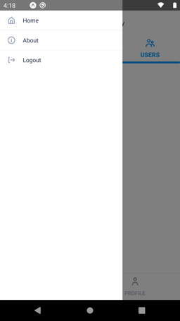

# Tracking Of Technology App Mobile

## Descrição

 **+**
 **+**

1. Aplicativo mobile para tracking de tecnologia utilizada pelo usuário ao decorrer do dia
2. Desenvolvido utilizando tecnologias como [React.js](https://pt-br.reactjs.org/), [React Native](https://reactnative.dev/), [UI-Kitten](https://akveo.github.io/react-native-ui-kitten/) e [Expo](https://expo.io/)
3. Tela Desenvolvidas:

